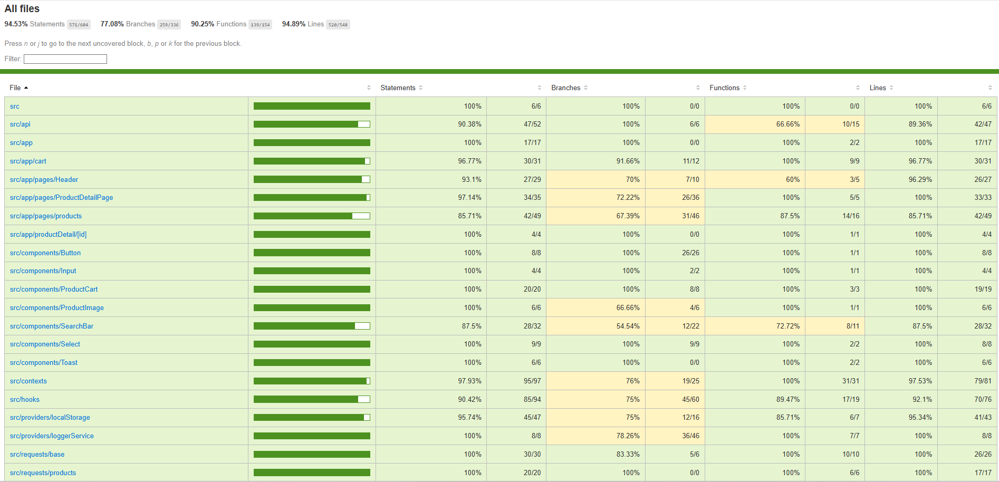

# Frontend Case Project - Rıdvan Üçdağ

## İçindekiler

- [Proje Hakkında](#proje-hakkında)
- [Teknolojiler](#teknolojiler)
- [Proje Kurulumu](#proje-kurulumu)
- [Testler ve Test Coverage](#testler-ve-test-coverage)

---

## Proje Hakkında

Bu proje, Next.js 15 ve React 19 kullanılarak geliştirilmiş basit bir frontend e-ticaret uygulamasıdır.  
Ürün listeleme, detay görüntüleme, sepet yönetimi, çoklu dil desteği, animasyonlar ve daha fazlasını içeren basit bir yapı sunar.

Özellikler:

- Ürünleri listeleme ve filtreleme
- Ürün detay sayfası
- Sepete ürün ekleme, çıkarma ve adet yönetimi
- Tema değiştirme (light/dark mode)
- Çoklu dil desteği (i18n)
- React Query ile veri fetching ve cache yönetimi
- Framer Motion ile animasyonlar
- Responsive ve erişilebilir arayüz

---

## Teknolojiler

- **Next.js 15** – React tabanlı framework  
- **React 19** – UI kütüphanesi  
- **TypeScript** – Statik tip kontrolü  
- **React Query (TanStack)** – API veri yönetimi  
- **Axios & axios-retry** – HTTP istekleri  
- **i18next** – Çoklu dil desteği  
- **Framer Motion** – Animasyonlar  
- **React Icons** – İkon kütüphanesi  
- **Jest & React Testing Library** – Test altyapısı

---

## Proje Kurulumu


### Gereksinimler

- Node.js (v18 veya üzeri önerilir)  
- Yarn veya npm

---

## Testler ve Test Coverage


--

### Kurulum Adımları

```bash
git clone https://github.com/kullaniciAdi/frontend-case-project.git
cd frontend-case-project
yarn install 
npm install
yarn dev

---
